# Light Jacket

In this project I set out to make a jacket for a costume with which I could change colors and pulse lights in a pattern,
[WLED](https://github.com/WLED/WLED) allowed for app-based control and minimal fiddling once powered on.

## <ins>PCB Update Mid April 2026 </ins>
Taking into account some of the problems with the board as it was:
* Addressable LED control not working as expected
* [No resistor on the LED data lines](https://quinled.info/data-signal-cable-conditioning/)
* No testing pads for 5v LED signals
* Microphone not working
* USB-A ports too close together for thick plugs
* UCB-C port in wrong corner for intended use with power bank
* Only one controllable onboard LED
* Unrounded corners

I decided to design another revision, this time in KiCad to further my skills with that software. Using the [LCSC library loader](https://github.com/dsa-t/jlc-kicad-lib-loader) addon bringing footprints and step models from my EasyEDA design was easy, and reconstructing the schematic in KiCad took only a little while.
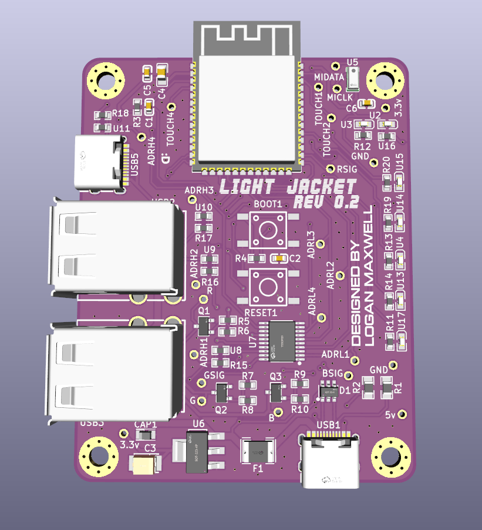

I realized while designing I wanted breakout boards for testing the microphone on its own, as well as USB-C boards with pads that match the size and layout of the strip. I used mousebites provided by [Panelization.pretty](https://github.com/madworm/Panelization.pretty) to add those breakouts to the side of the main board:
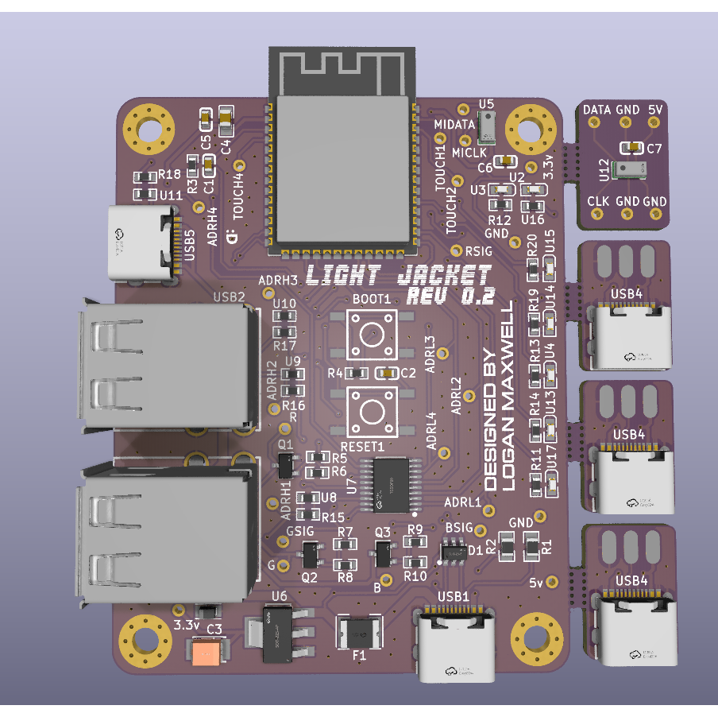

Unfortunately this was rejected by JLCPCB as containing too many individual designs to quality for lower manufacturing costs, likely due to extra care needed in handling panelized boards. I instead decided to make the breakouts contained within the same shape as the main board (which JLCPCB did accept) and will use the score-and-snap method to separate them when it arrives.
<table>
  <tr>
    <td>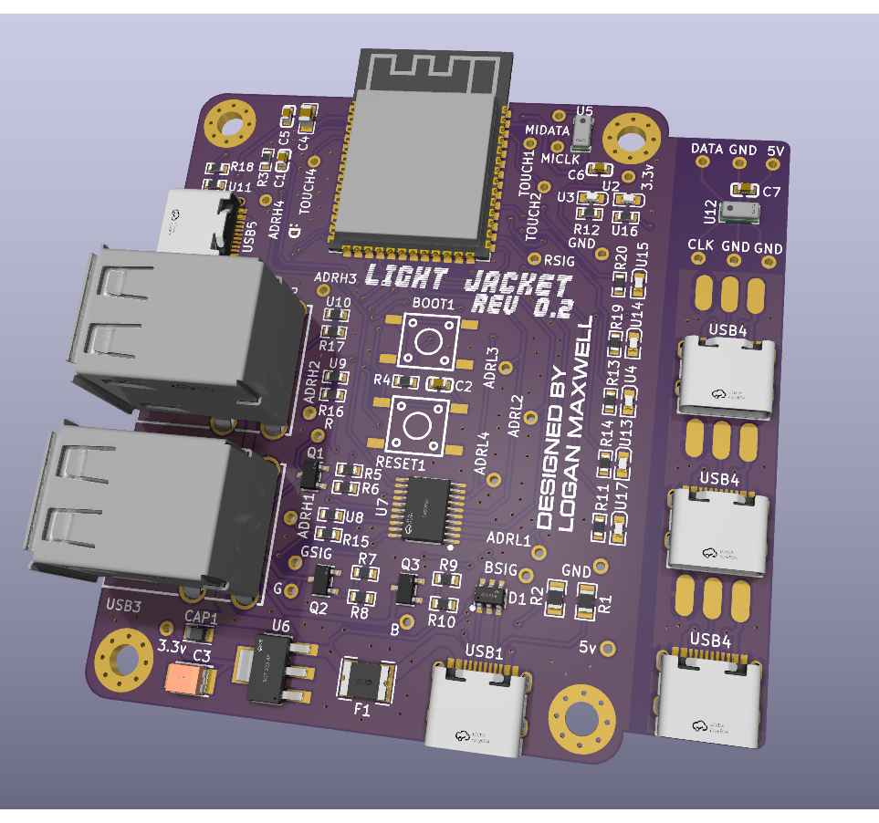</td>
    <td>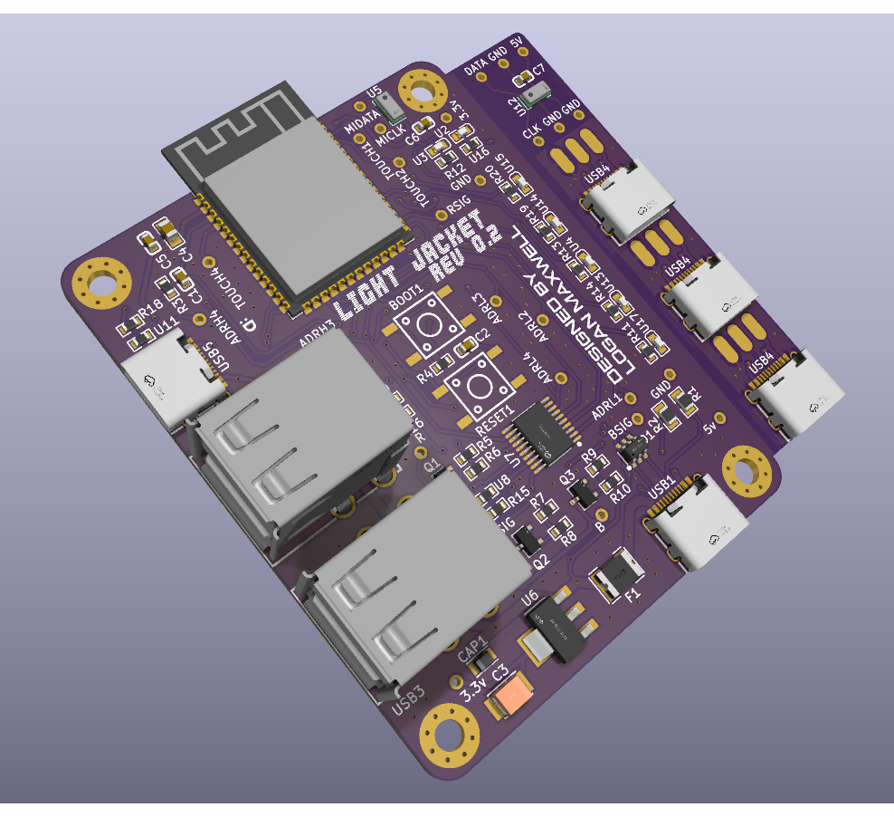</td>
    <td>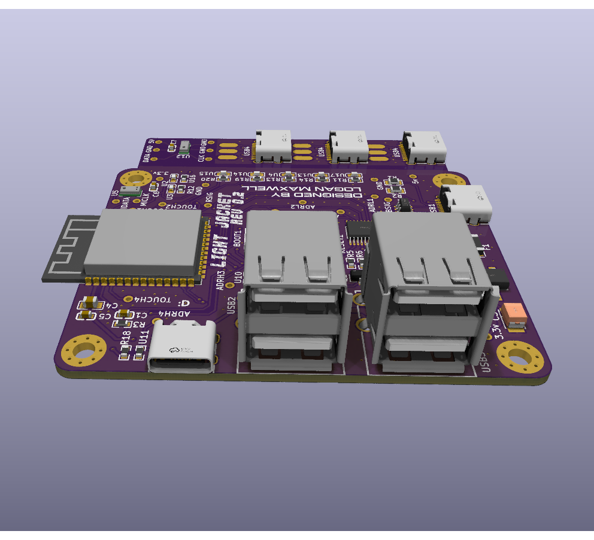</td>
  </tr>
</table>

## <ins>PCB Update Early April 2026 </ins>
The first revision of the PCB arrived and came out of JLCPCB fab better than expected. I was a little bit worried about silkscreen readability as text 0.15mm stroke width was ever so slightly below their [manufacturing capabilities](https://jlcpcb.com/capabilities/pcb-capabilities), but it came through perfectly readable.
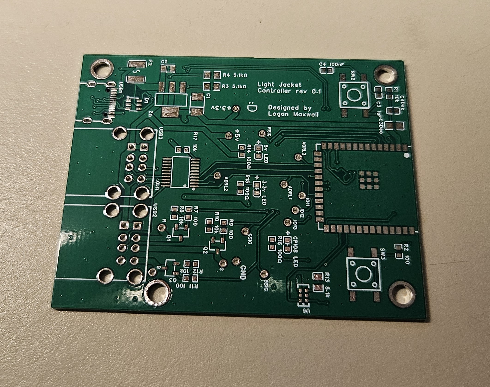
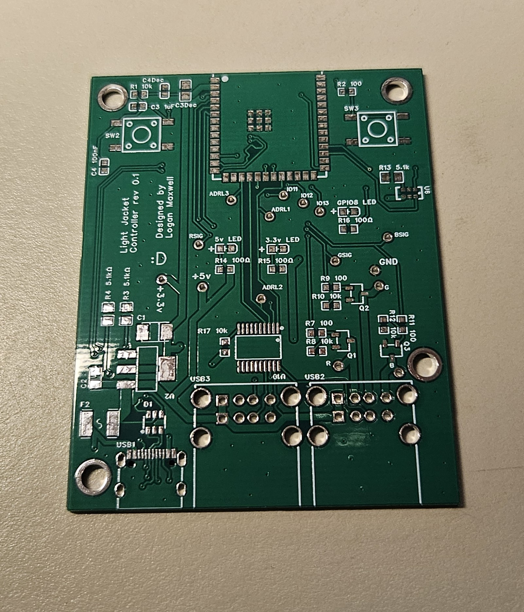

Soldering was relatively easy if not time-consuming, as this was my first experience with hor air reflow soldering for SMD components.
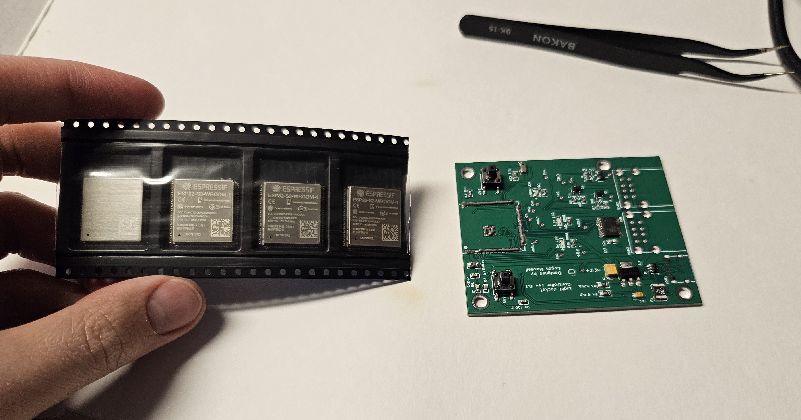
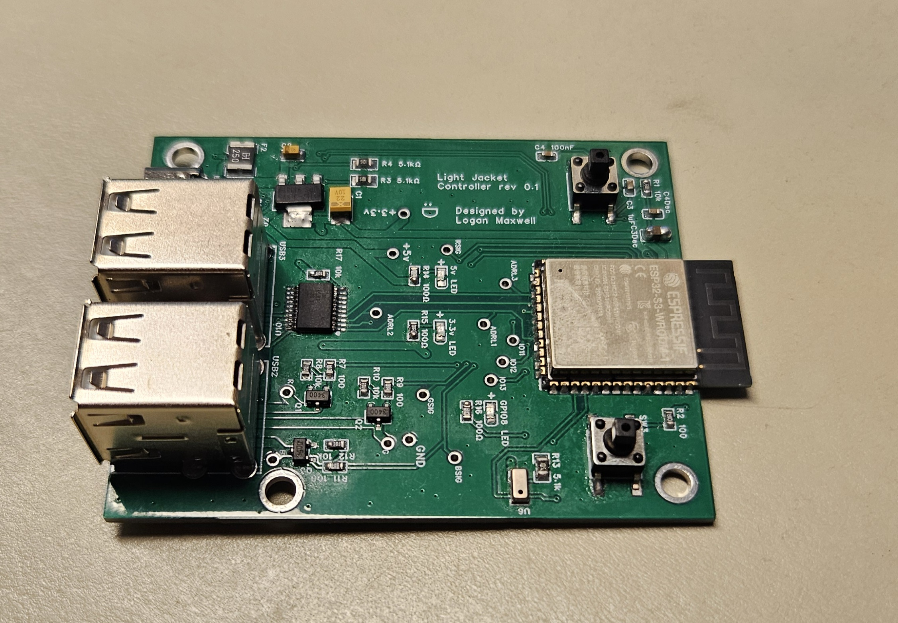

Once assembled I could verify that both my 3.3v and 5v power rails were functioning with both LED's lighting up, and went ahead and installed WLED v16 on it through USB. The PWM RGB strip control worked without a hitch, and could drive an LED strip with a common voltage and individual color grounds.

I did run into a problem with addressable strip control where I would get a randomly blinking mess. See it here:

 
  
Caution: Flashing Lights

   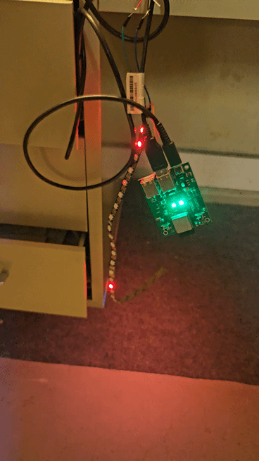 

I don't have an oscilloscope to be able to test and see what's happening to the signal, but some research leads me to believe it might have to do with the way I'm using the TXS0108EPWR for level shifting. It seems to be designed more for high-speed onboard signal shifting whose output runs [less than 6 inches](https://learn.sparkfun.com/tutorials/level-shifter---8-channel-txs0108e-hookup-guide/all#:~:text=Signal%20Oscillations,level%20shifters.).
The bi-directionality of the TXS0108EPWR could mean that it's picking up noise on the "output" that triggers it to switch directions and start communicating in the wrong direction.
Letting the supply voltage and ground travel though a USB cable while connecting the data line straight to a 3.3v signal output (which should be too low for the WS2812b) from the ESP32 made it work no problem.

## <ins>PCB Update March 2026 </ins>
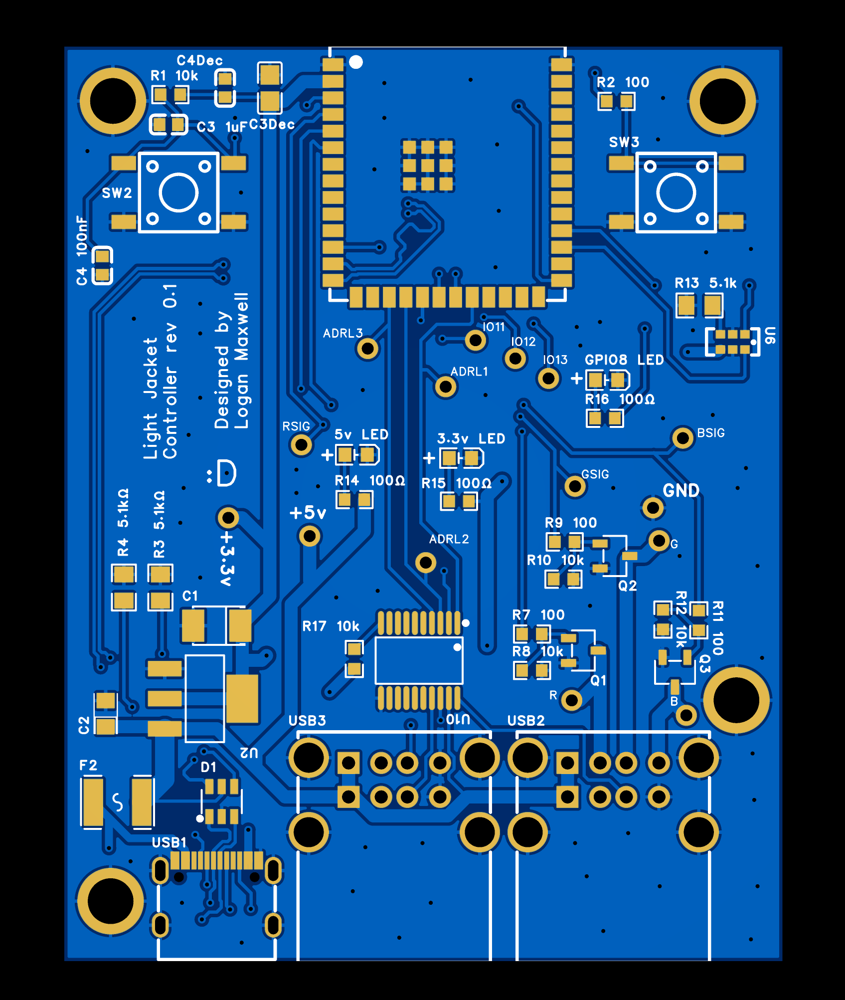
Currently awaiting delivery of a prototype PCB board for this jacket. Using an ESP32-S3 and a digital microphone to make audio reactivity possible with WLED.
Chose to use USB-C for programming and power due to availability of cables, and the USB-A plug (but not the full standard) for the connection to the lights. Exploring USB-C plug or magnetic connectors for this purpose.
Gerber files can be found [here](PCB/LightJacketV0.1.zip).
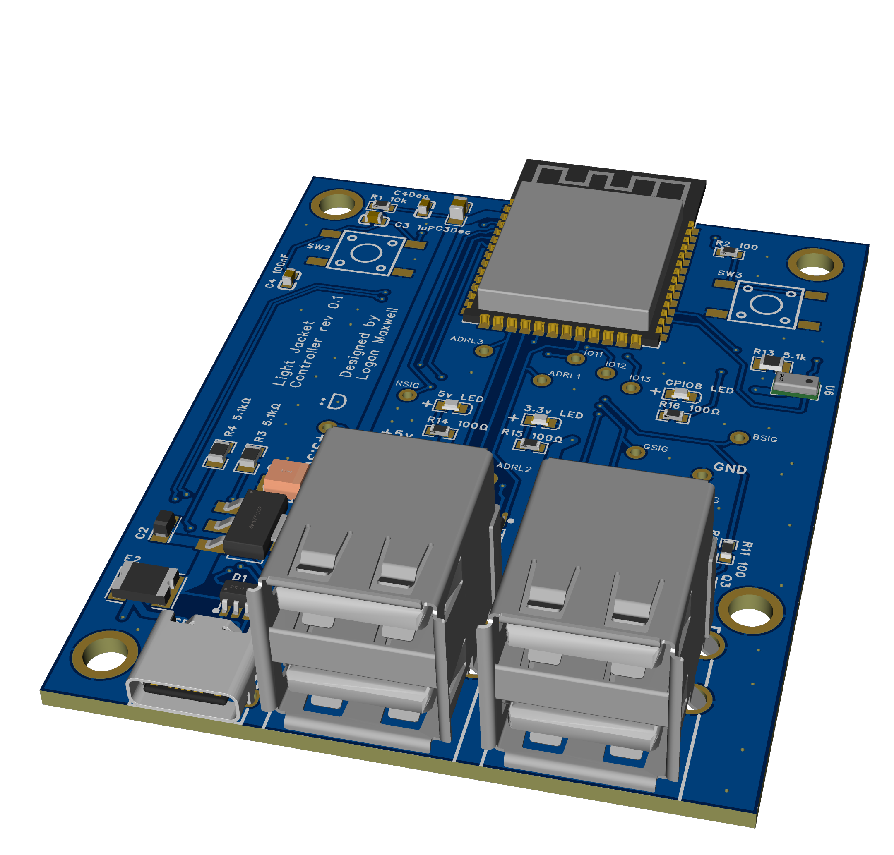
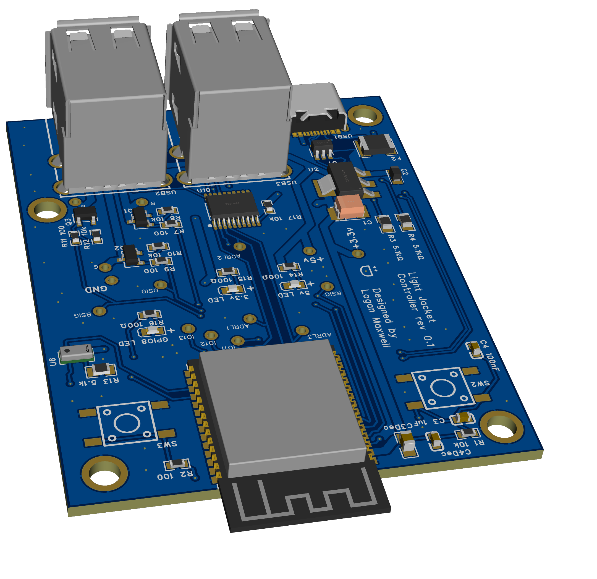

## Jacket Construction

The strip runs hidden along the inside next to the zipper for an ambient lighting effect, and visible around the collar for the exposed design choice.
The battery and circuit board tuck into an existing pocket on the inside.

I decided to sew in the strip for durability rather than use adhesive, and tried to match existing seam lines.

## Circuitry
I used an ESP8266 and a single color RGB LED strip as that's what I had on hand, but opting for a ESP32 increases options available for WLED, and addressable LED strips allow for more impressive patterns to be displayed.
WLED has an option to control single color strips with PWM signals for each RGB channel, and I fed signal each into a transistor to boost the power for that channel.
Power is supplied by a phone battery bank connected by a USB cable spliced to provide 5V to the ESP as well as each transistor. 

*Transistor side of perfboard*

*ESP8266 on perfboard*

## Next steps
I would like to upgrade the microcontroller to an ESP32 and add a microphone, as WLED has better support for audio reactivity on that board.
Ultimately want the jacket to react to sounds, such as pulsing along to the beat of music on a dancefloor, or visually alerting the user to a dangerously loud environment.

## Images

